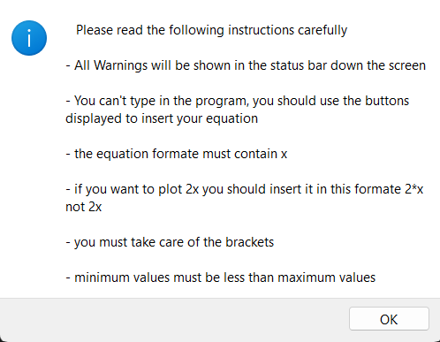
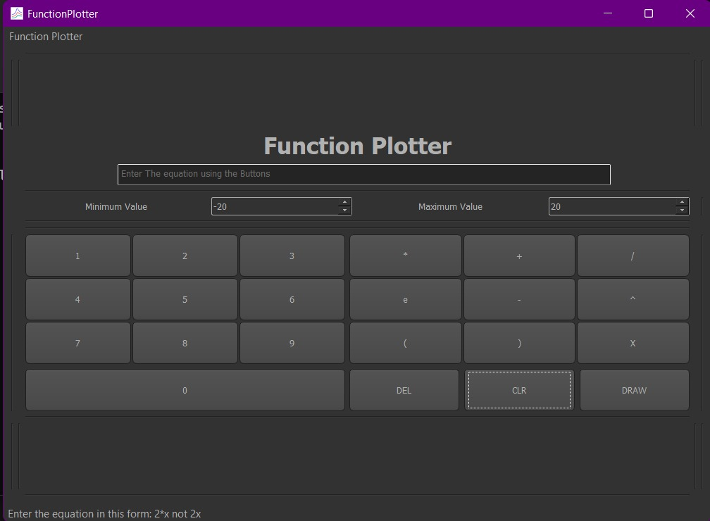
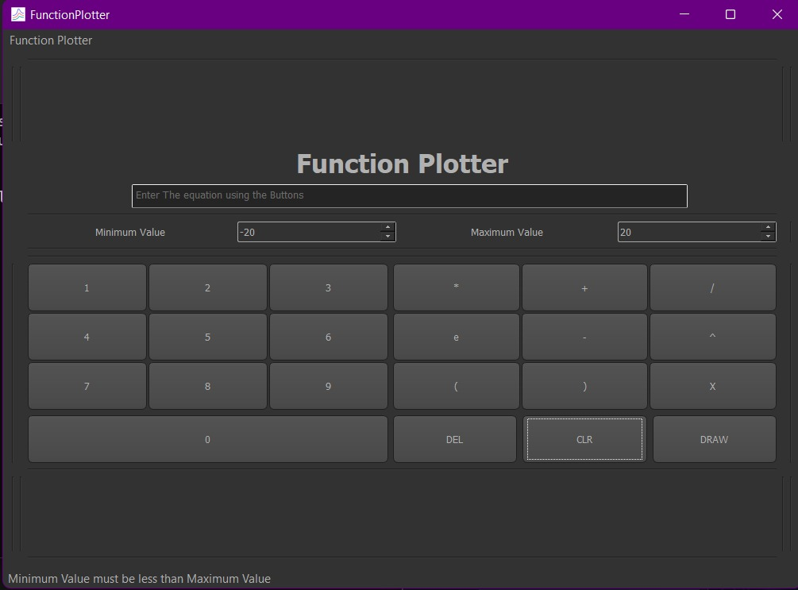
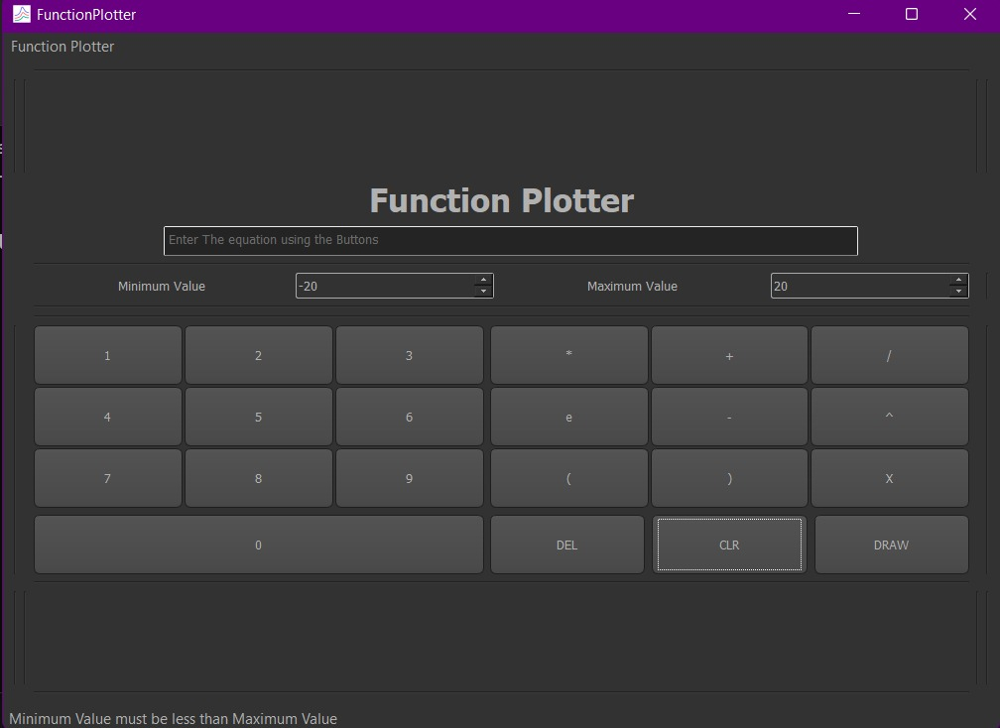
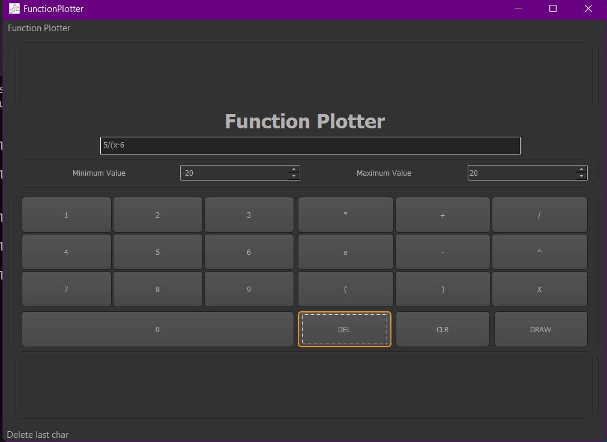
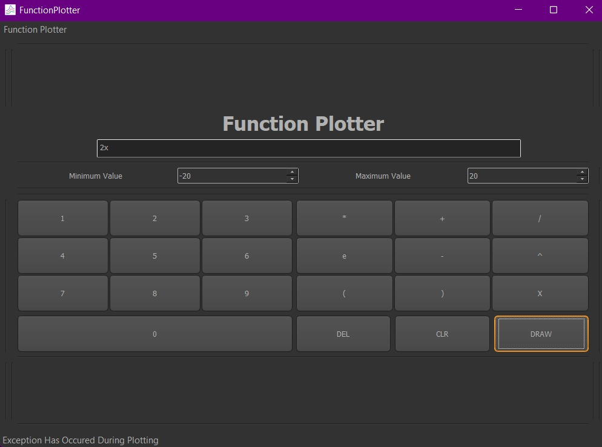
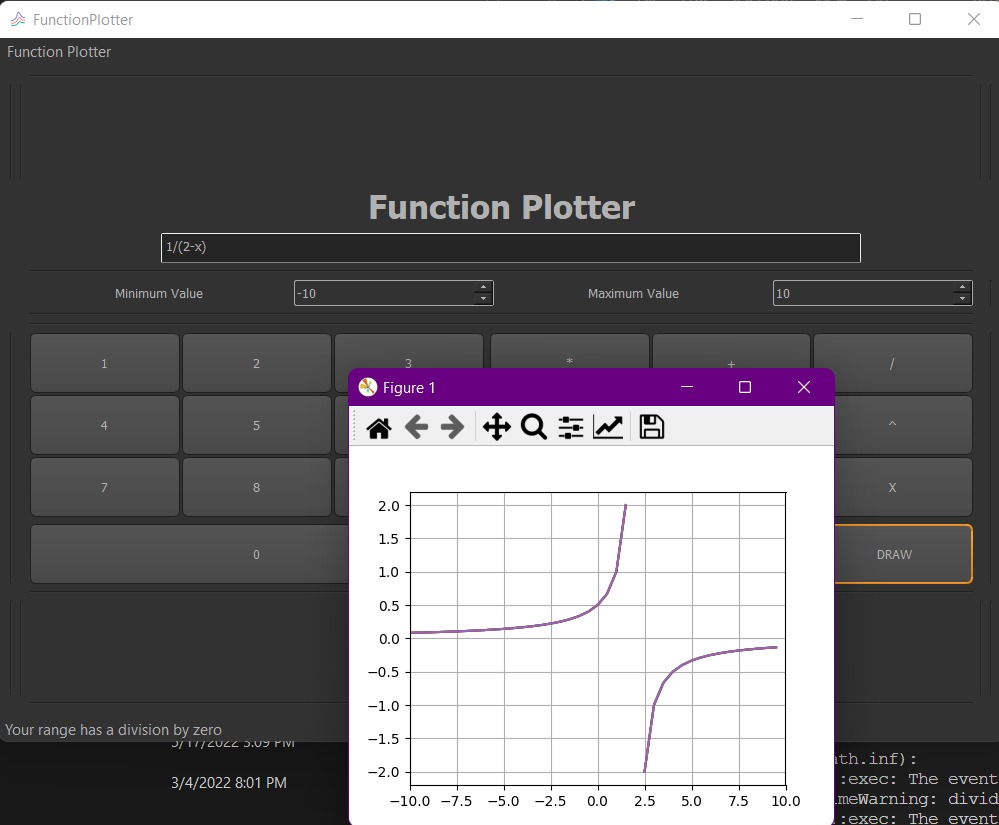
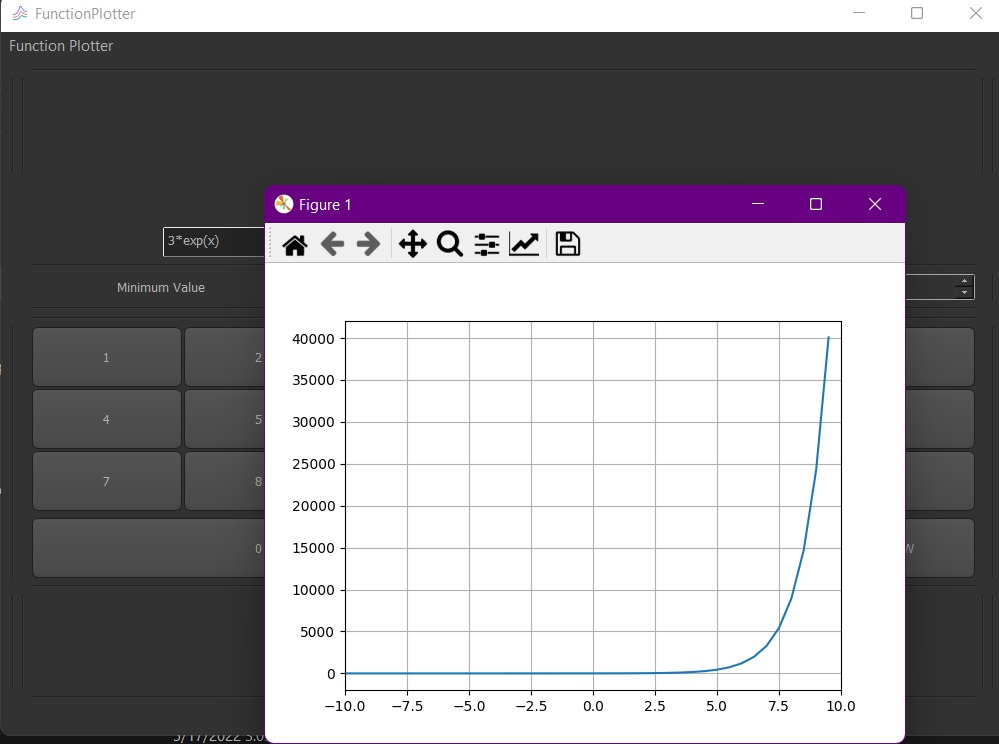
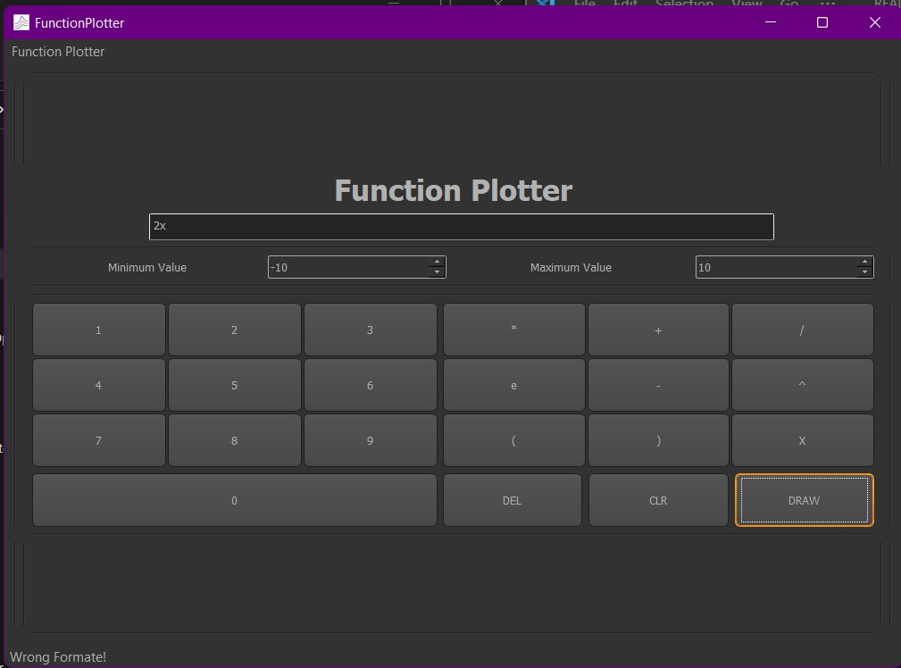
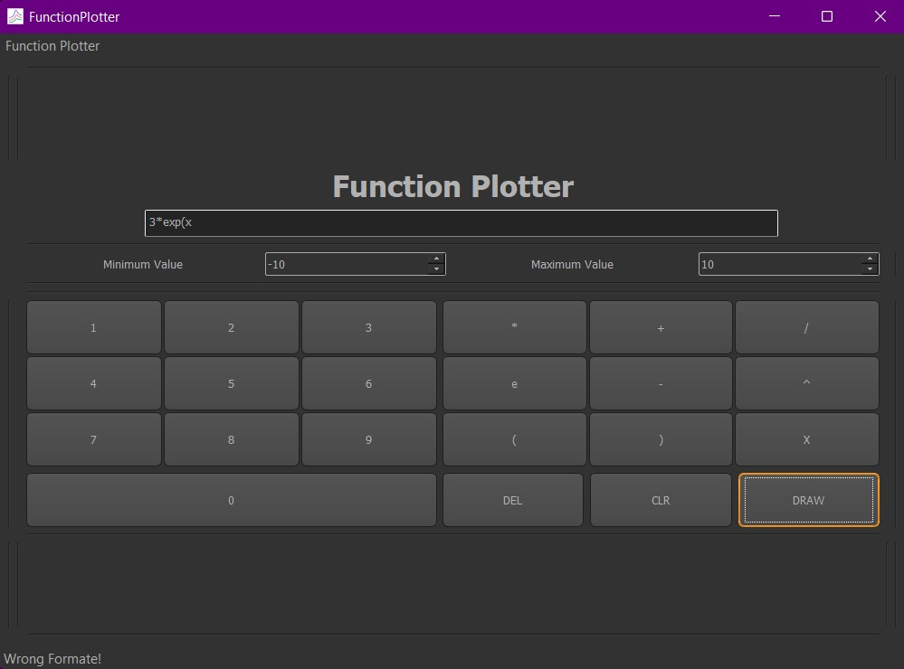

# Function Plotter

## About
* Responsive GUI which plot mathmatical equations on specified range

## 📝 Description
* Takes any arbitrary equation from the user and plot it on given range .
## 🏁 Getting Started

## Dependencies

* Python 
* QTDesigner 

## 💻 Installing

```
git clone https://github.com/abdelazizSalah/FunctionPlotter
```

### 📷 Screenshots

### Tips Screen


### hovering over 

## input 


## minimum value 


## maximum value 


## Del Button


## CLR Button


## Draw Button



### plotting 2*x + x^2


### plotting 1/(2 - x)


### plotting 3*exp(x)


### Wrong inputs

## 2x


## missing closing bracket

